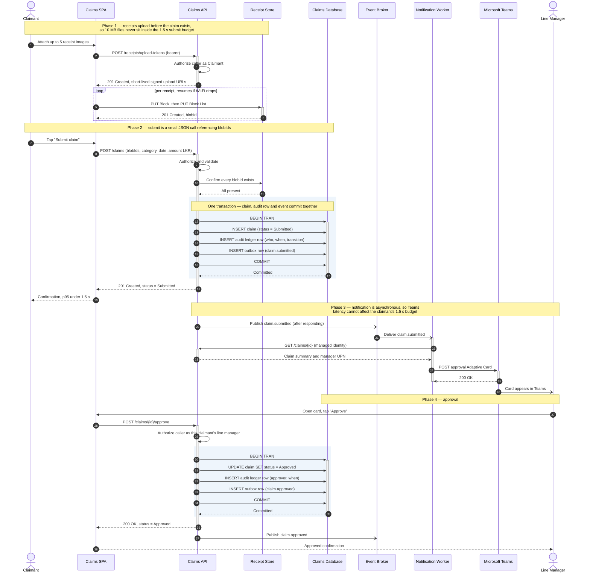
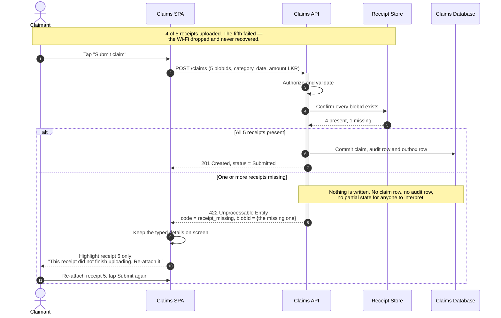
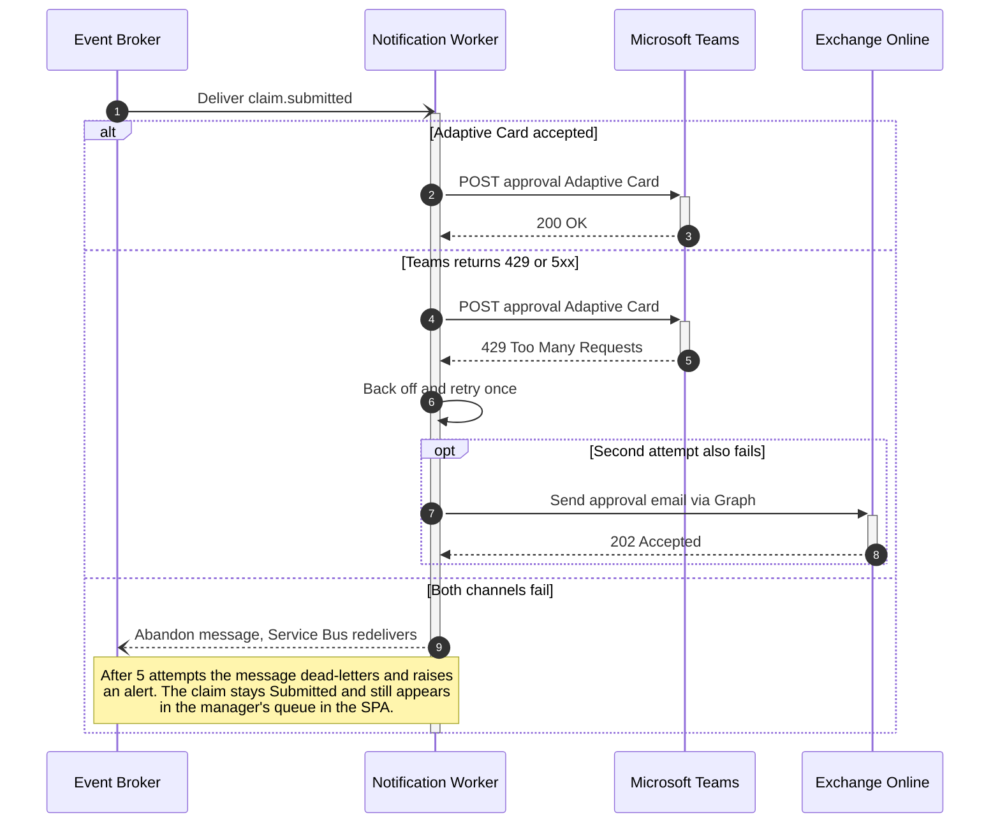

# Sequence — Submit and Approve a Claim

## Happy path

---

## Error path 1 — a receipt upload never finished

**The decision:** the claim is **not created**. We refuse rather than accept a partial
claim, because a claim with 4 of 5 receipts reaches a manager who has no rule for judging
it, and reaches finance who pay real money against incomplete evidence. Preventing a bad
state is cheaper than managing one — every state we allow must then be handled in the UI,
in approval rules, in the audit ledger and in the CSV export.

This is why ADR-0004 uploads receipts **before** the claim exists: the ordering is chosen
so this failure cannot produce a broken claim.

**Two supporting decisions, visible in the diagram:**
- The API names **which** blobId is missing, so the SPA can highlight that one file rather
  than showing a generic error.
- Nothing was written to the database, so the SPA **keeps the typed details on screen**.
  The claimant re-attaches one file and submits again — roughly fifteen seconds.

**Why 422 and not 500.** A 500 means "we broke". This is not a failure of the system — the
system correctly refused an invalid request. The claimant can fix it themselves, so the
response carries the information needed to fix it.

## Error path 2 — Teams is down, email fallback takes over

The claim is already safely `Submitted`. Only the notification is at risk, which is
exactly why it was moved out of the request.

